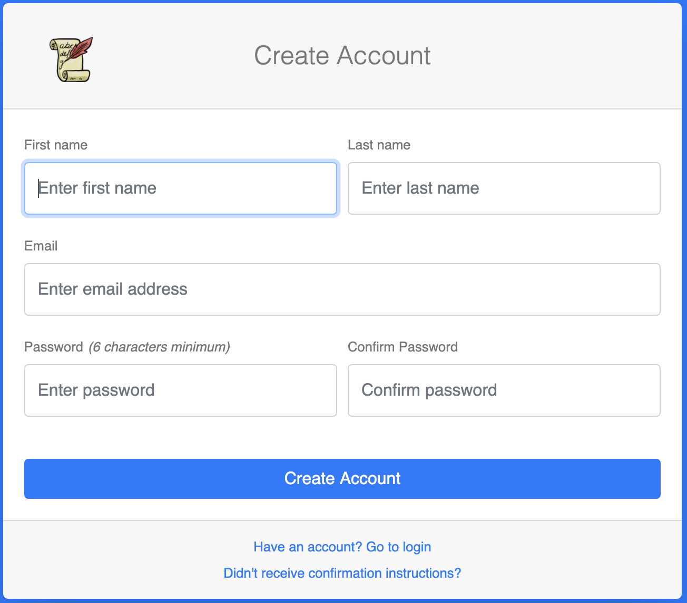
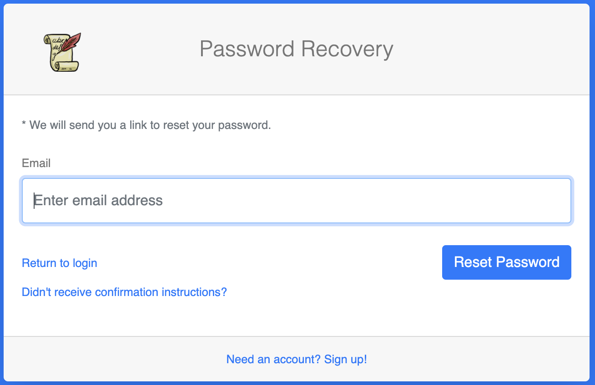

# SharpNotes 


[](http://hits.dwyl.com/{username}/https://githubcom/reymillenium/sharpspring_coding_challenge)

## Ruby version
2.7.0

## System dependencies
- Rails 6.0.3.2
- PostgreSQL 11.6
- Node.js 12.16.2

## Configuration

Configuration is managed by [Figaro](https://github.com/laserlemon/figaro). Copy basic configuration blueprint using `$ cp config/application.yml_example config/application.yml` and contact any team member for any sensitive credentials needed.

## Database creation


You need to run it each time when developing the app. Second of all - to have node and ruby dependencies installed, use:

```
$ bundle && yarn
```

## Database initialization

```
$ bundle exec rake db:create
```

## How to run the test suite

```
$ rake db:test:prepare
$ bundle exec rspec
```

## Production Deployment instructions

Deployment is fully managed by [Heroku](https://www.heroku.com/).
After any change on the code is necessary to execute on the terminal:
```
$ git push heroku
```
- That will update the [production](https://sharp-notes.herokuapp.com/) release.

***

## Screen Shots

### Login page


### Sign Up form


### Pass recovery form


### Resend confirmation email form


### Edit account form


### Notes index page


### New Note page


### About page


***
## Contact
Created by [Reinier Garcia](https://www.reiniergarcia.com/) - feel free to contact me!


